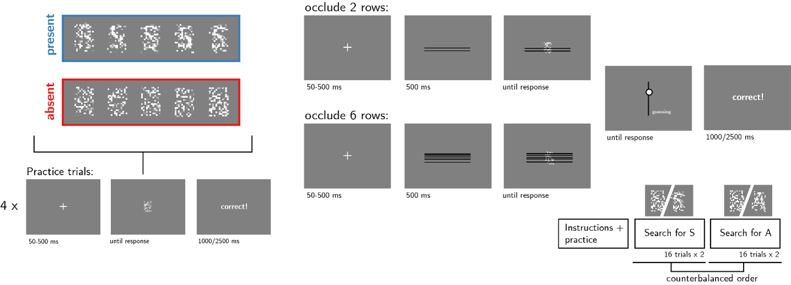
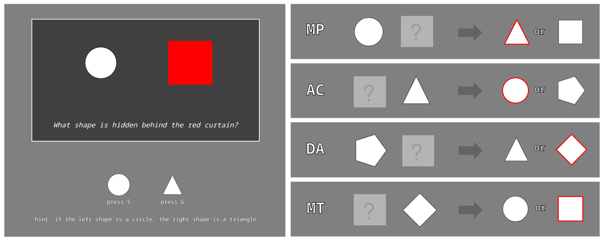

```{r setup, include = FALSE}
library('groundhog')
groundhog.library(
  c(
    'papaja', #for apa formatting
    'pwr', # for power calculation
    'tidyverse', # for pipe %>%
    'emmeans',
    'afex',
    'dplyr'
  ), "2024-06-09"
)

r_refs("r-references.bib")
knitr::opts_chunk$set(echo=FALSE, message=FALSE, warning=FALSE, results='hide')
```

```{r analysis-preferences}
# Seed for random number generation
set.seed(42) 
knitr::opts_chunk$set(cache.extra = knitr::rand_seed)
```

# Motivation

In a previous study [@mazor_role_2024], participants performed a letter detection task, where on different trials different proportions of the display (2 or 6 rows) were occluded with black lines. In target-present decisions, participants were slower, less confident, and missed more targets when more of the display was occluded. In contrast, there seemed to be a population divide in the effect of occlusion on target-absent response times, with some slowing down for more occluded displays and others speeding up. Additionally, participants varied in whether occlusion made them commit more or fewer false alarms.

In this study, we aim to investigate whether performance on a logical reasoning task can predict participants’ differential tendencies in their decisions about target absence. To achieve this, we will run a two-part study. The first part is a replication of the previous study, and the second part is a logical reasoning task where participants make inferences about the identity of hidden shapes based on a given conditional statement.


# Methods

We report how we determined our sample size, all data exclusions, all manipulations, and all measures in the study. 

## Participants

The research complies with all relevant ethical regulations, and was approved by the Medical Sciences Interdivisional Research Ethics Committee at the University of Oxford (Ethics Approval Reference R91912/RE001). Participants will be recruited via Prolific, and will give informed consent prior to their participation. To be eligible to take part in this study, their Prolific approval rate will need to be 95% or higher, their reported first language English, their age between 18 and 60, and their vision normal or corrected-to-normal. We will collect data until we reach 160 included participants (after applying our pre-registered exclusion criteria). The first part of the study will take 15 minutes to complete, and the second part will take 5 minutes to complete. Participants will be paid £2.25 for their participation in the first part, and an additional £0.75 for their participation in the second part. This is equivalent to an hourly wage of £9.00.

## Procedure

#### Part I

The first part of the study is mostly identical to Exp. 2 in [@mazor_role_2024], with two exceptions: the maximum visibility level in target-present trials will not be calibrated, but fixed at 35%, and confidence ratings will be given in all blocks of the experiment. 

Participants will detect the presence or absence of a target letter (S or A, in different blocks) in a patch of dynamic grayscale noise presented at 15 frames per second. In each frame, noise will be generated by randomly sampling grayscale values from a target image I. Specifically, for each pixel *S~ij~*, we will display the grayscale value for the corresponding pixel in the original image *I~ij~* with some probability p, and the grayscale value of a randomly chosen pixel *I~i'j'~* with probability 1-*p*. On target-absent trials, p will be set to 0, such that the grayscale values of all pixels will be randomly shuffled. On target-present trials, **_p_ will be set to 0.35**. Responses will be delivered using the F and G keyboard keys, and response-mapping will be counterbalanced across subjects.

```{r design, echo=FALSE, fig.cap="Figure 1. Experimental design. Left: example stimuli (unoccluded) and practice trials. Top right: trial structure in the main blocks of the experiment, in trials where 2 or 6 pixel rows are occluded. Bottom right: overall experiment structure.", out.width = '75%'}

```

After reading the instructions, participants will complete four practice trials. In case their accuracy in these four practice trials falls below 3/4, they will be reminded of task instructions and given additional practice trials, until they reach the desired accuracy level. Otherwise, they will continue to the main part of the experiment. Then, they will complete another four trials to practice rating their confidence by moving a dial on a vertical continuous scale, after which they will be asked a multiple-choice comprehension question. If their answer to this question is incorrect, they will be reminded of the instructions and repeat the process until they answer it correctly. Only then will they continue to the main part of the experiment.  Here, their task will be exactly the same, but a fixed proportion of pixel rows (2 or 6 out of 18, on different trials within the same block; see Fig. 1) will be occluded by black pixels. 

The main part of the experiment will comprise four blocks of 16 trials. For approximately half of the participants, in blocks 1 and 2 the target letter will be S and in blocks 3 and 4 it will be A. The order of letters will be reversed for the other half.

After completing the four blocks, participants will receive a multiple-choice question:

Sometimes the black lines hid more of the display, and sometimes less. Did you feel this had any effect on how difficult it was to spot the letter?

a)	Yes! It was harder when more of the display was hidden behind black lines.
a)	Yes! It was harder when less of the display was hidden behind black lines.
a)	No! The number of black lines had no effect on how difficult it was to spot the letter.


#### Part II

In the second part of the study, the participants will be introduced to a scenario where two different shapes were drawn on a blackboard, according to a rule stated as the following conditional: “If the left shape is a circle, the right shape will be triangle”. The range of possible shapes consists of the following: circle, square, diamond, pentagon, triangle.

After receiving instructions, participants will be presented with trials where they see two shapes inside a dark frame, only one of which is visible. The other shape is hidden behind a “red curtain” -- a red square. Underneath the shapes reads: “What shape is hidden behind the red curtain?”. In order to respond, participants need to choose one of two options presented to them underneath the blackboard, recorded by the S and G keyboard keys. A reminder of the rule is on the screen for every trial. There are four different trial types:

1. A circle is revealed on the left, the right shape is hidden (*Modus Ponens*; MP).
1. A non-circle shape is revealed on the left, the right shape is hidden (*Denying the Antecedent*; DA)
1. The left shape is hidden, a triangle is revealed on the right (*Affirming the Consequent*; AC)
1. The left shape is hidden, a non-triangle shape is revealed on the left (*Modus Tollens*; MT).

For MP and DA trials, the choice options will consist of a triangle and a non-triangle shape; for MT and AC trials, the choice options will consist of a circle and a non-circle shape. Non-triangle shapes will be sampled uniformly from the full set of shapes, including the circle and the shape presented on the blackboard (whenever this shape is not a triangle). Similarly, non-circle shapes will be sampled uniformly from the full set of shapes, including the triangle and the shape presented on the blackboard (whenever this shape is not a circle). Immediately after deciding the identity of the hidden shape, participants will rate their confidence by moving a dial on a continuous scale. The experiment will comprise a single block of 16 trials.

```{r design, echo=FALSE, fig.cap="Figure 2. Experimental design. Left: example screen. Right: example stimulus and option pairs for each inference type. Model-consistent response options are underlined in red.", out.width = '75%'}

```

This will be followed by the introduction of a novel and rare shape, a star. Following a comprehension question about the likelihood of this shape occurring, the participants will be subject to one final MT trial, where a non-triangle shape is revealed on the right and the choice options being circle or star.

## Randomization

The order and timing of experimental events, as well as the luminance values of pixels within a trial, will be determined pseudo-randomly by the Mersenne Twister pseudorandom number generator, initialized in a way that ensures registration time-locking [@mazor_novel_2019].

## Data analysis

### Rejection criteria

For the letter-detection task, participants will be excluded if their accuracy falls below 50%. Participants will also be excluded if they have extremely fast or slow reaction times (below 100 milliseconds or above 7 seconds in more than 25% of the trials). Trials with reaction times below 100 milliseconds or above 7 seconds will be excluded from the reaction time analysis.

```{r}
# read-in data 
df <- read.csv('rowOcclusion/data/jatos_results_data_batch1.csv', sep = ",", header = TRUE) # this is still non-existent

# tidy 
raw_df <- df %>%
  dplyr::filter(trial_type=='noisyLetter'& (test_part=='test1' | test_part=='test2')) %>%
  dplyr::select(PROLIFIC_PID, RT, hide_proportion, present, correct, confidence, response, presence_key) %>%
  dplyr::rename(subj_id=PROLIFIC_PID) %>%
  dplyr::mutate(
    RT=as.numeric(RT),
    confidence=as.numeric(confidence),
    present=as.numeric(present),
    response = response == presence_key,
    correct = ifelse(correct == 'true', TRUE, FALSE))

# exclusions
low_accuracy <- raw_df %>%
  dplyr::group_by(subj_id) %>%
  dplyr::summarise(
    accuracy = mean(correct)) %>%
  dplyr::filter(accuracy<0.5) %>%
  dplyr::pull(subj_id)

too_slow <- raw_df %>%
  dplyr::group_by(subj_id) %>%
  dplyr::summarise(
    third_quartile_RT = quantile(RT,0.75)) %>%
  dplyr::filter(third_quartile_RT>7000) %>%
  dplyr::pull(subj_id)

too_fast <- raw_df %>%
  dplyr::group_by(subj_id) %>%
  dplyr::summarise(
    first_quartile_RT = quantile(RT,0.25)) %>%
  dplyr::filter(first_quartile_RT<100) %>%
  dplyr::pull(subj_id)

to_exclude <- c(
  low_accuracy,
  too_slow,
  too_fast
) %>% unique()

task_df <- raw_df %>%
  filter(!(subj_id %in% to_exclude))
```


For the shapes-inference task, participants will be excluded if they fail to make the MP inference 2 out of 4 times or more. As the rule is on the screen for every trial, repeated failure to make this inference is likely a sign of inattentiveness. We will also exclude participants for having extremely fast reaction times (below 100 milliseconds in more than 25% of the trials). Additionally, trials with reaction times below 100 milliseconds will be excluded from the analysis. For the reaction-time analysis in particular, participants with extremely slow reaction times (above 9 seconds in more than 25% of the trials) and trials with reaction times above 9 seconds will also be excluded.

```{r}
# read-in data shapes task 
df2 <- read.csv('shapesInference/data/jatos_results_data_batch1.csv', sep = ",", header = TRUE)

# tidy
raw_df2 <- df2 %>%
  dplyr::filter(trial_type=='jsShapes' & rare_option=='false') %>%
  dplyr::select(PROLIFIC_PID,shapes,occluder,options,response,RT,confidence) %>%
  dplyr::rename(subj_id=PROLIFIC_PID) %>%
  dplyr::mutate(decision=ifelse(response==0,as.numeric(substr(options,2,2)),as.numeric(substr(options,4,4))),
                RT=as.numeric(RT),
                confidence=as.numeric(confidence))

# add inference type
raw_df2 <- raw_df2 %>% 
  dplyr::mutate(
    inference_type = case_when(
      substr(shapes, 2, 2) == "0" & substr(shapes, 4, 4) == "1" & occluder == 'right' ~ 'MP',
      substr(shapes, 2, 2) == "0" & substr(shapes, 4, 4) == "1" & occluder == 'left' ~ 'AC',
      !(substr(shapes, 2, 2) == "0" & substr(shapes, 4, 4) == "1") & occluder == 'right' ~ 'DA',
      !(substr(shapes, 2, 2) == "0" & substr(shapes, 4, 4) == "1") & occluder == 'left' ~ 'MT'
    ))

# specify inference "accepted" 
raw_df2 <- raw_df2 %>%
  dplyr::mutate(
    inference_accepted = case_when(
      inference_type == "MP" & decision == 1 ~ TRUE,
      inference_type == "AC" & decision == 0 ~ TRUE,
      inference_type == "DA" & decision %in% c(0,2,3,4) ~ TRUE,
      inference_type == "MT" & decision %in% c(1,2,3,4) ~ TRUE,
      TRUE ~ FALSE
    ))
raw_df2$inference_type <- as.factor(raw_df2$inference_type)

# calculate proportion accepted
proportion_accepted <- raw_df2 %>%
  dplyr::group_by(subj_id, inference_type) %>%
  dplyr::summarise(
    proportion_accepted = sum(inference_accepted)/n()
  )
raw_df2 <- raw_df2 %>%
  left_join(proportion_accepted, by = c("subj_id", "inference_type"))

# low accuracy
low_accuracy_shapes <- raw_df2 %>%
  dplyr::filter(inference_type == "MP" & proportion_accepted < 0.75 ) %>%
  dplyr::pull(subj_id)  

# too fast 
too_fast_shapes <- raw_df2 %>%
  dplyr::group_by(subj_id) %>%
  dplyr::summarise(
    first_quartile_RT = quantile(RT,0.25)) %>%
  dplyr::filter(first_quartile_RT<100) %>%
  dplyr::pull(subj_id)

# exclusions for analysis
to_exclude_shapes <- c(low_accuracy_shapes,too_fast_shapes) %>% unique()
task_df2 <- raw_df2 %>%
  filter(!(subj_id %in% to_exclude_shapes))

# extra exclusions for RT analysis
too_slow_shapes <- raw_df2 %>%
  dplyr::group_by(subj_id) %>%
  dplyr::summarise(
    third_quantile_RT = quantile(RT,0.75)) %>%
  dplyr::filter(third_quantile_RT>9000) %>%
  dplyr::pull(subj_id)

to_exclude_shapes_RT <- c(low_accuracy_shapes, too_fast_shapes, too_slow_shapes) %>% unique()

task_df2_RT <- raw_df2 %>%
  filter(!(subj_id %in% to_exclude_shapes_RT)) 
```


### Hypotheses and analysis plan

This study is designed to test whether individual differences in the effect of occlusion on perceptual decisions in the absence of the target are correlated with individual differences in the capacity for logical inference, and specifically in modus tollens inference.

#### Part I 

The first part of the study is designed to test the timing of decisions to terminate evidence accumulation in the absence of a target as a function of stimulus occlusion. Therefore, pre-registered hypotheses A1-10 follow the same structure as the ones pre-registered for Exp. 2 in [@mazor_role_2024].

*Hypothesis A1 (PRESENCE/ABSENCE RESPONSE TIME)*: We will test the null hypothesis that response times are similar for target-present and target-absent responses, aiming to replicate the finding that decisions about the target-absence are slower than decisions about target-presence [@mazor_metacognitive_2021]. This will be tested using a paired t-test on the median individual-level reaction times from correct trials only.

```{r}
# effect of presence/absence on reaction time
response_RT <- task_df %>%
  dplyr::filter(RT > 100 & RT < 7000 & correct == TRUE) %>%  
  dplyr::group_by(subj_id, present) %>%
  dplyr::summarise(RT = median(RT)) %>%
  tidyr::pivot_wider(names_from = present, values_from = RT) %>%
  dplyr::mutate(response_RT = `1` - `0`)
t.test(response_RT$response_RT)
mean(response_RT$`0`)
mean(response_RT$`1`)
```

*Hypothesis A2 (OCCLUSION EFFECT ON REACTION TIME IN PRESENCE)*: We will test the null hypothesis that target-present response times are similar when 2 and 6 rows of the display are occluded, aiming to replicate the finding that decisions about presence are slower when more of the stimulus is occluded [@mazor_role_2024]. This will be tested using a paired t-test on the median individual-level reaction times from correct trials only.

```{r}
# occlusion effect on RT in presence
RT_occlusion_presence <- task_df %>%
  dplyr::filter(RT > 100 & RT < 7000 & present == 1 & correct == TRUE) %>%
  dplyr::group_by(subj_id, hide_proportion) %>%
  dplyr::summarise(RT = median(RT))%>%
  tidyr::pivot_wider(names_from = hide_proportion, values_from = RT) %>%
  dplyr::mutate(RT_occlusion_presence = `0.35` - `0.1`)
t.test(RT_occlusion_presence$RT_occlusion_presence)
mean(RT_occlusion_presence$`0.1`)
mean(RT_occlusion_presence$`0.35`)
```

*Hypothesis A3 (OCCLUSION EFFECT ON REACTION TIME IN ABSENCE)*: We will test the null hypothesis that target-absent reaction times are similar when 2 or 6 rows are occluded, aiming to replicate the finding that decisions about absence are on average not slower when more of the stimulus is occluded [@mazor_role_2024]. This will be tested using a paired t-test on the median individual response times in correct trials only.

```{r}
# occlusion effect on RT in absence
RT_occlusion_absence <- task_df %>%
  dplyr::filter(RT > 100 & RT < 7000 & present == 0 & correct == TRUE) %>%
  dplyr::group_by(subj_id, hide_proportion) %>%
  dplyr::summarise(RT = median(RT)) %>%
  tidyr::pivot_wider(names_from = hide_proportion, values_from = RT) %>%
  dplyr::mutate(RT_occlusion_absence = `0.35` - `0.1`)
t.test(RT_occlusion_absence$RT_occlusion_absence)
mean(RT_occlusion_absence$`0.1`)
mean(RT_occlusion_absence$`0.35`)
```

*Hypothesis A4 (OCCLUSION RESPONSE INTERACTION ON REACTION TIME)*: We will test the null hypothesis that the effect of occlusion on reaction time is similar in target-absent and target-present responses, aiming to replicate the finding that the effect of occlusion on reaction time is different in decisions about presence compared to decisions about absence [@mazor_role_2024]. This will be tested using a group-level t-test on a subject-level contrast in correct trials only: *(median(RT~P,6~) - median(RT~P,2~)) - (median(RT~A,6~) - median(RT~A,2~))* where where P and A stand for present and absent, and 2 and 6 represent the number of occluded rows.

```{r}
# occlusion response interaction on reaction time 
RT_occlusion_response <- inner_join(
  RT_occlusion_presence, 
  RT_occlusion_absence,
  by = "subj_id") %>%
  mutate(RT_occlusion_response = RT_occlusion_presence - RT_occlusion_absence)
t.test(RT_occlusion_response$RT_occlusion_response)
```

*Hypothesis A5 (SENSITIVITY)*: We will test the null hypothesis that perceptual sensitivity (measured as *d' = z(H) - z(F)*) is equal as a function of the proportion of hidden pixels. To allow the extraction of *d’* for participants who committed no false-alarms or misses, we will add 0.5 to miss, hit, false-alarm and correct rejection counts [@snodgrass_pragmatics_1988].

```{r}
# general accuracy measures 
accuracy_occlusion <- task_df2 %>%
  dplyr::group_by(subj_id, hide_proportion) %>%
  summarise(
    hit_rate = (sum(correct & present)+0.5)/(sum(present)+1), 
    fa_rate = (sum(!correct & !present)+0.5)/(sum(!present)+1),
    d = qnorm(hit_rate)-qnorm(fa_rate),
    c = -0.5*(qnorm(hit_rate)+qnorm(fa_rate)))

# d prime 
dprime <- accuracy_occlusion %>%
  dplyr::select(subj_id, hide_proportion,d) %>%
  tidyr::pivot_wider(names_from=hide_proportion, values_from=d) %>%
  dplyr::mutate(dprime_occlusion=`0.1`-`0.35`)
t.test(dprime$dprime_occlusion)
mean(dprime$`0.1`)
mean(dprime$`0.35`)

# d prime shaped by hit and fa rate so still calculate those as well
hit_rate_occlusion <- accuracy_occlusion %>%
  dplyr::select(subj_id,hide_proportion,hit_rate) %>%
  tidyr::pivot_wider(names_from = hide_proportion, values_from = hit_rate) %>%
  dplyr::mutate(hit_rate_occlusion = `0.1` - `0.35`)
t.test(hit_rate_occlusion$hit_rate_occlusion)

fa_rate_occlusion <- accuracy_occlusion %>%
  dplyr::select(subj_id,hide_proportion,fa_rate) %>%
  tidyr::pivot_wider(names_from = hide_proportion, values_from = fa_rate) %>%
  dplyr::mutate(fa_rate_occlusion = `0.1` - `0.35`)
t.test(fa_rate_occlusion$fa_rate_occlusion)

```

*Hypothesis A6 (CRITERION)*: We will test the null hypothesis that decision criterion (measured as *c=-0.5(z(H)+z(F))*) is unaffected by the proportion of hidden pixels. To allow the extraction of a decision criterion for participants who committed no false-alarms or misses, we will add 0.5 to miss, hit, false-alarm and correct rejection counts [@snodgrass_pragmatics_1988].

```{r}
# criterion 
criterion <- accuracy_occlusion %>%
  dplyr::select(subj_id, hide_proportion,c) %>%
  tidyr::pivot_wider(names_from=hide_proportion, values_from=c) %>%
  dplyr::mutate(criterion_occlusion=`0.1`-`0.35`)
t.test(criterion$criterion_occlusion)
mean(criterion$`0.1`)
mean(criterion$`0.35`)
```

*Hypothesis A7 (PRESENCE/ABSENCE CONFIDENCE RATINGS)*: We will test the null hypothesis that confidence ratings are similar for target-present and target-absent responses, aiming to replicate the finding that subjective confidence levels are lower for decisions about absence than decisions about presence [@mazor_metacognitive_2021]. This will be tested using a paired t-test on the mean individual-level confidence ratings from correct trials only.

```{r}
# effect of presence/absence on confidence
response_confidence <- task_df %>%
  dplyr::filter(correct == TRUE) %>%
  dplyr::group_by(subj_id, present) %>%
  dplyr::summarise(confidence=mean(confidence)) %>%
  tidyr::pivot_wider(names_from = present, values_from = confidence) %>%
  dplyr::mutate(response_confidence = `1` - `0`)
t.test(response_confidence$response_confidence)
mean(response_confidence$`0`)
mean(response_confidence$`1`)
```

*Hypothesis A8 (OCCLUSION EFFECT ON CONFIDENCE IN PRESENCE)*: We will test the null hypothesis that target-present confidence ratings are similar when 2 or 6 rows of the display are occluded, aiming to replicate the finding that participants are less confident in decisions about presence when more of the display is occluded [@mazor_role_2024]. This will be tested using a paired t-test on the mean individual-level confidence ratings in correct trials only.

```{r}
# occlusion effect on confidence in presence
conf_occlusion_presence <- task_df %>%
  dplyr::filter(present == 1 & correct == TRUE) %>%
  dplyr::group_by(subj_id, hide_proportion) %>%
  dplyr::summarise(confidence = mean(confidence)) %>%
  tidyr::pivot_wider(names_from = hide_proportion, values_from = confidence) %>%
  dplyr::mutate(conf_occlusion_presence = `0.35` - `0.1`)
t.test(conf_occlusion_presence$conf_occlusion_presence)
mean(conf_occlusion_presence$`0.1`)
mean(conf_occlusion_presence$`0.35`)
```

*Hypothesis A9 (OCCLUSION EFFECT ON CONFIDENCE IN ABSENCE)*: We will test the null hypothesis that target-absent confidence ratings are similar when 2 or 6 rows of the display are occluded, aiming to replicate the finding that participants are less confident in decisions about absence when more of the display is occluded [@mazor_role_2024]. This will be tested using a paired t-test on the mean individual-level confidence ratings in correct trials only.

```{r}
# occlusion effect on confidence in absence
conf_occlusion_absence <- task_df %>%
  dplyr::filter(present == 0 & correct == TRUE) %>%
  dplyr::group_by(subj_id, hide_proportion) %>%
  dplyr::summarise(confidence = mean(confidence)) %>%
  tidyr::pivot_wider(names_from = hide_proportion, values_from = confidence) %>%
  dplyr::mutate(conf_occlusion_absence = `0.35` - `0.1`)
t.test(conf_occlusion_absence$conf_occlusion_absence)
mean(conf_occlusion_absence$`0.1`)
mean(conf_occlusion_presence$`0.35`)
```

*Hypothesis A10 (OCCLUSION RESPONSE INTERACTION ON CONFIDENCE)*: We will test the null hypothesis that the effect of occlusion on confidence ratings is similar in target-present and target-absent responses, aiming to replicate the finding that the effect of occlusion on subjective confidence levels is similar in decisions about presence and decisions about absence [@mazor_role_2024]. This will be tested using a group-level t-test on a subject-level contrast in correct trials only: *(mean(confidence~P,6~) - mean(confidence~P,2~)) - (mean(confidence~A,6~) - mean(confidence~A,2~))* where *P* and *A* stand for present and absent, and 2 and 6 represent the number of occluded rows.

```{r}
# occlusion response interaction on confidence 
conf_occlusion_response <- inner_join(
  conf_occlusion_presence,
  conf_occlusion_absence,
  by = "subj_id") %>%
  mutate(conf_occlusion_response = conf_occlusion_presence - conf_occlusion_absence)
t.test(conf_occlusion_response$conf_occlusion_response)
```

#### Part II

Hypotheses B1-3 test differences in decisions, decision times and decision confidence, as a function of the type of logical inference.

*Hypothesis B1 (INFERENCE-TYPE EFFECT ON REACTION TIME)*: We will test the null hypothesis that reaction times are similar for all inference types. This will be tested using a one-way ANOVA with four levels (for each of the inference types) on median individual-level reaction times from model-consistent responses only. A response is considered model-consistent if it completes the shape pair to be [circle, triangle] or [non-circle, non-triangle].

```{r}
# median individual-level response times for each inference type
RT_df <- task_df2_RT %>%
  dplyr::filter(RT > 100 & RT < 9000 & inference_accepted == TRUE) %>%
  dplyr::select(RT,inference_type,subj_id) %>%
  dplyr::mutate(subj_id = as.factor(subj_id)) %>%
  dplyr::group_by(subj_id, inference_type) %>%
  dplyr::summarise(median_RT = median(RT), .groups = 'drop') # do this or no?

# anova 
aov_RT <- aov_ez("subj_id", "median_RT", RT_df, within = "inference_type", na.rm=TRUE)
summary(aov_RT)

# post-hoc contrasts 
summary(contrast(emmeans(aov_RT, "inference_type"), method = "pairwise"))
```

*Hypothesis B2 (INFERENCE-TYPE EFFECT ON CONFIDENCE)*: We will test the null hypothesis that subjective confidence level ratings are similar for all inference types. This will be tested using a one-way ANOVA with four levels on mean individual-level confidence ratings from model-consistent responses only.

```{r}
# mean individual-level confidence for each inference type 
conf_df <- task_df2 %>%
  dplyr::filter(RT > 100 & inference_accepted == TRUE) %>%
  dplyr::select(confidence,inference_type,subj_id) %>%
  dplyr::mutate(subj_id = as.factor(subj_id)) %>%
  dplyr::group_by(subj_id, inference_type) %>%
  dplyr::summarise(confidence = mean(confidence), .groups = 'drop') 

# anova 
aov_conf <- aov_ez("subj_id", "confidence", conf_df, within = "inference_type", na.rm=TRUE)
summary(aov_conf)

# post-hoc comparisons 
summary(contrast(emmeans(aov_conf, "inference_type"), method = "pairwise"))

```

*Hypothesis B3 (INFERENCE-TYPE EFFECT ON PROPORTION OF MODEL-CONSISTENT RESPONSES)*: We will test the null hypothesis that similar proportions of model-consistent responses  will be given for each inference type. This will be tested using a one-way ANOVA with four levels on individual-level proportions of model-consistent responses made per inference type.

```{r}
# individual-level proportions per inference type 
prop_df <- task_df2 %>%
  dplyr::filter(RT > 100) %>%
  dplyr::select(proportion_accepted,inference_type,subj_id) %>%
  dplyr::mutate(subj_id = as.factor(subj_id))  

# anova 
aov_prop <- aov_ez("subj_id", "proportion_accepted", prop_df, within = "inference_type", na.rm=TRUE)
summary

# post-hoc comparisons 
summary(contrast(emmeans(aov_prop, "inference_type"), method = "pairwise"))
```

#### Part III

Finally, the overarching aim of the study, which we test with Hypotheses C1-C10, is to test whether subjective confidence levels in logical inferences, specifically in Modus Tollens, predict response times in absence of a target as a function of stimulus occlusion. Making a MT inference based on a given conditional (e.g., “If there is a circle on the left, there will be a triangle on the right”), involves observing the negation of the consequent (e.g., the shape on the right is a square) and performing a backwards inference to reach the conclusion that the antecedent must also be false (e.g., the shape on the left is not a circle). One hypothesis is that, similar to MT, in decisions about absence a backwards inference is made from a negative premise (“I am not seeing the target”), by using a conditional (“If the target is present, I would see it”) to ultimately conclude that something is not true (“the target is not absent”). Therefore, participants’ competence in making MT inferences (measured here as their subjective confidence in valid MT inferences relative to other inference types, valid and invalid) could manifest in their perceptual decisions about absence, especially when manipulating the validity of the conditional statement (“If the target is present, I would see it") by occluding parts of the display. 

Unless otherwise specified, only correct responses from part I and model-consistent responses from part II will be included in this set of analyses.

*Hypothesis C1 (MT-MP CONFIDENCE/OCCLUSION EFFECT ON ABSENCE RT)*: We will test the null hypothesis that there is no association between the difference in subjective confidence in MT versus MP inferences and the effect of occlusion on reaction times in target-absent decisions. This will be tested using a Pearson’s correlation test on the difference between mean individual-level confidence ratings in MT minus MP, with the individual-level difference in median target-absent reaction times in 6- versus 2-row occlusion.

```{r}
# occlusion effect on RT in absence with confidence contrast MP and MT
occlusion_RT_absent <- task_df %>%
  dplyr::filter(RT > 100 & RT < 7000 & correct == TRUE) %>%
  dplyr::group_by(subj_id) %>%
  dplyr::summarise(
    occlusion_RT_absent = (median(RT[present == 0 & hide_proportion == 0.35]) - median(RT[present == 0 & hide_proportion == 0.10])))

MT_MP_conf <- task_df2 %>%
  dplyr::filter(RT > 100 & inference_accepted == TRUE) %>%
  dplyr::select(confidence,inference_type,subj_id) %>%
  dplyr::group_by(subj_id) %>%
  dplyr::summarise(
    MT_MP_conf = mean(confidence[inference_type == 'MT']) - mean(confidence[inference_type == 'MP']))

corr_data <- occlusion_RT_absent %>%
  inner_join(MT_MP_conf, by = "subj_id") %>%
  select(-subj_id) 
corr_data <- as.data.frame(corr_data)

cor.test(corr_data$occlusion_RT_absent, corr_data$MT_MP_conf, type = "pearson", na.rm=TRUE)
```

*Hypothesis C2 (POLARITY RT CORRELATION)*: We will test the null hypothesis that there is no association between the effect of decision polarity—positive or negative—on reaction times in the two tasks. In the shape-inference task, this will be defined as the following contrast on median reaction times: (MT+AC)-(MT+DA). In the letter detection task, polarity will be defined as the difference in median reaction times between target-present or target-absent responses. Subject-level contrasts will be subjected to a group-level to a one-sided Pearson correlation test, testing for a positive correlation only.

```{r}
# RT difference for positive/negative inferences correlation with RT difference for yes/no responses 
RT_polarity <- task_df2_RT %>%
  dplyr::filter(RT > 100 & RT < 9000 & inference_accepted == TRUE) %>%
  dplyr::select(RT,inference_type,subj_id) %>%
  dplyr::group_by(subj_id) %>%
  dplyr::summarise(
    polarity_RT = median(RT[inference_type %in% c('MT','DA')]) - median(RT[inference_type %in% c('MP','AC')])
  ) 

corr_data_RT <- response_RT %>% 
  inner_join(RT_polarity, by = "subj_id") 

corr_data_RT <- as.data.frame(corr_data_RT) %>%
  dplyr::select(-subj_id)

cor.test(corr_data_RT$response_RT, corr_data_RT$polarity_RT, type = "pearson")
```

*Hypothesis C3 (INFERENCE CONFIDENCE/OCCLUSION EFFECT ON ABSENCE RT)*: We will test the null hypothesis that confidence ratings in the shape-inference task cannot predict the effect of occlusion on target-absent reaction time in the letter detection task. We will test the significance of individual predictors in a multiple regression with three predictor variables (mean individual-level confidence ratings in MP, MT and DA with AC as baseline) and one outcome variable (median individual-level reaction time difference between 6 and 2-row occlusion in target-absent decisions). 

```{r}
# extract relevant measures from letter detection task 
occlusion_RT <- task_df %>%
  dplyr::filter(RT > 100 & RT < 7000 & correct == TRUE) %>%
  dplyr::group_by(subj_id, present) %>%
  dplyr::summarise(
    occlusion_RT = median(RT[hide_proportion == 0.35], na.rm = TRUE) - median(RT[hide_proportion == 0.10], na.rm = TRUE)
  ) %>%
  dplyr::ungroup() %>%  #this is acc important bc mean and sd need to be calc over entire dataset 
  dplyr::mutate(
    occlusion_RT_z = (occlusion_RT - mean(occlusion_RT, na.rm = TRUE)) / sd(occlusion_RT, na.rm = TRUE)
  )

occlusion_confidence <- task_df %>%
  dplyr::filter(correct == TRUE) %>%
  dplyr::group_by(subj_id, present) %>%
  dplyr::summarise(
    occlusion_confidence = mean(confidence[hide_proportion == 0.35], na.rm = TRUE) - mean(confidence[hide_proportion == 0.10], na.rm = TRUE)
  ) %>%
  dplyr::ungroup() %>% 
  dplyr::mutate(
    occlusion_confidence_z = (occlusion_confidence - mean(occlusion_confidence, na.rm = TRUE)) / sd(occlusion_confidence, na.rm = TRUE)
  )

occlusion_accuracy <- task_df %>%
  dplyr::group_by(subj_id, present, hide_proportion) %>%
  dplyr::summarise(
    accuracy = sum(!correct)/n(),
    .groups = 'drop') %>%
  dplyr::group_by(subj_id, present) %>%
  dplyr::summarise(
    occlusion_accuracy = accuracy[hide_proportion == 0.35] - accuracy[hide_proportion == 0.10]
  ) %>%
  dplyr::ungroup() %>%
  dplyr::mutate(
    occlusion_accuracy_z = (occlusion_accuracy - mean(occlusion_accuracy, na.rm = TRUE)) / sd(occlusion_accuracy, na.rm = TRUE)
  )

occlusion_df <- occlusion_RT %>%
  left_join(occlusion_confidence, by = c("subj_id", "present")) %>%
  left_join(occlusion_accuracy, by = c("subj_id", "present"))

# extract relevant measures from shapes task
inference_confidence <- task_df2 %>%
  dplyr::filter(RT > 100 & inference_accepted == TRUE) %>%
  dplyr::select(confidence,inference_type,subj_id) %>%
  dplyr::group_by(subj_id) %>%
  dplyr::summarise(
    MT = mean(confidence[inference_type == 'MT']) - mean(confidence[inference_type == 'AC']),
    MP = mean(confidence[inference_type == 'MP']) - mean(confidence[inference_type == 'AC']),
    DA = mean(confidence[inference_type == 'DA']) - mean(confidence[inference_type == 'AC'])
  )

# bind together
analysis_df <- occlusion_df %>%
  inner_join(inference_confidence, by = "subj_id")

# regression of occlusion effect on RT in absence as a function of confidence in inference types 
absent_df <- analysis_df %>% 
  dplyr::filter(present == 0) 

summary(RT_absent_model <- lm(occlusion_RT_z ~ MT + MP + DA, data = absent_df, na.action=na.omit))

```

*Hypothesis C4 (INFERENCE CONFIDENCE/OCCLUSION EFFECT ON PRESENCE RT)*: We will test the null hypothesis that confidence ratings in the shape-inference task cannot predict the effect of occlusion on target-present reaction time in the letter detection task. We will test the significance of individual predictors in a multiple regression with three predictor variables (mean individual-level confidence ratings in MP, MT and DA with AC as baseline) and one outcome variable (median individual-level reaction time difference between 6 and 2-row occlusion in target-present decisions). 

```{r}
# regression of occlusion effect on RT in presence as a function of confidence in inference types 
present_df <- analysis_df %>% 
  dplyr::filter(present == 1) 

summary(RT_present_model <- lm(occlusion_RT_z ~ MT + MP + DA, data = present_df, na.action=na.omit))

```

*Hypothesis C5 (RT PREDICTION: GOODNESS OF FIT)*: We will test the null hypothesis that subjective confidence levels for inference-types predict similar proportions of variance in occlusion effects on reaction time in target-absent and target-present decisions. This will be tested using a non-parametric permutation test (code attached).

```{r}
# non-parametric permutation test for present vs absent model for RT 
get_rsquared_diff_RT <- function(df) {
  
  present_df <- df %>% filter(present==1);
  absent_df <- df %>% filter(present==0);
  
  present_model <- lm(occlusion_RT~MT+MP+DA, data=present_df) %>%
    summary()
  
  absent_model <- lm(occlusion_RT~MT+MP+DA, data=absent_df) %>%
    summary()
  
  return(absent_model$r.squared-present_model$r.squared)
}

shuffle_present <- function(df) {
  new_df <- df %>%
    dplyr::group_by(subj_id) %>%
    dplyr::mutate(flip = rbinom(1,1,0.5),
                  old_present = present,
                  present = ifelse(flip, as.integer(!present),present))
  return(new_df)
}

true_difference_RT <- get_rsquared_diff_RT(analysis_df);

N = 10000; #number of permutations
null_dist_RT = c();

for (i in 1:N) {
  shuffled_df <- shuffle_present(analysis_df);
  shuffled_diff_RT <- get_rsquared_diff_RT(shuffled_df);
  null_dist_RT = c(null_dist_RT, shuffled_diff_RT);
}

p_value_RT <- mean(abs(true_difference_RT)<=abs(null_dist_RT))
```

*Hypothesis C6 (INFERENCE CONFIDENCE/OCCLUSION EFFECT ON ABSENCE CONFIDENCE)*: We will test the null hypothesis that confidence ratings in the shape-inference task cannot predict the effect of occlusion on target-absent confidence in the letter detection task. We will test the significance of individual predictors in a multiple regression with three predictor variables (mean individual-level confidence ratings in MP, MT and DA with AC as baseline) and one outcome variable (mean individual-level reaction time difference between 6 and 2-row occlusion in target-absent decisions). 

```{r}
# confidence in absent
summary(conf_absent_model <- lm(occlusion_confidence_z ~ MT + MP + DA, data = absent_df, na.action=na.omit))
```

*Hypothesis C7 (INFERENCE CONFIDENCE/OCCLUSION EFFECT ON PRESENCE CONFIDENCE)*: We will test the null hypothesis that confidence ratings in the shape-inference task cannot predict the effect of occlusion on target-present confidence in the letter detection task. We will test the significance of individual predictors in a multiple regression with three predictor variables (mean individual-level confidence ratings in MP, MT and DA with AC as baseline) and one outcome variable (mean individual-level reaction time difference between 6 and 2-row occlusion in target-present decisions). 

```{r}
# confidence in present
summary(conf_present_model <- lm(occlusion_confidence_z ~ MT + MP + DA, data = present_df, na.action=na.omit))
```

*Hypothesis C8 (CONFIDENCE PREDICTION: GOODNESS OF FIT)*: We will test the null hypothesis that subjective confidence levels for inference-types predict similar proportions of variance in occlusion effects on confidence ratings in target-absent and target-present decisions. This will be tested using a non-parametric permutation test (code attached).

```{r}
# permutation test
get_rsquared_diff_conf <- function(df) {
  
  present_df <- df %>% filter(present==1);
  absent_df <- df %>% filter(present==0);
  
  present_model <- lm(occlusion_confidence~MT+MP+DA, data=present_df) %>% summary()
  absent_model <- lm(occlusion_confidence~MT+MP+DA, data=absent_df) %>% summary()
  
  return(absent_model$r.squared-present_model$r.squared)
}

true_difference_conf <- get_rsquared_diff_conf(analysis_df);

N = 10000; #number of permutations
null_dist_conf = c();

for (i in 1:N) {
  shuffled_df <- shuffle_present(analysis_df);
  shuffled_diff_conf <- get_rsquared_diff_conf(shuffled_df);
  null_dist_conf = c(null_dist_conf, shuffled_diff_conf);
}

p_value_conf <- mean(abs(true_difference_conf)<=abs(null_dist_conf))
```

*Hypothesis C9 (INFERENCE CONFIDENCE/OCCLUSION EFFECT ON FALSE ALARM RATE):* We will test the null hypothesis that confidence ratings in the shape-inference task cannot predict the effect of occlusion on the false alarm rate in the letter detection task. We will test the significance of individual predictors in a multiple regression with three predictor variables (mean individual-level confidence ratings in MP, MT and DA with AC as baseline) and one outcome variable (the difference in the false alarm rate between 6 and 2-row occlusion). 

```{r}
# false alarm rate
summary(accuracy_absent_model <- lm(occlusion_accuracy_z ~ MT + MP + DA, data = absent_df, na.action=na.omit))

```

*Hypothesis C10 (INFERENCE CONFIDENCE/OCCLUSION EFFECT ON MISS RATE)*: We will test the null hypothesis that confidence ratings in the shape-inference task cannot predict the effect of occlusion on the miss rate in the letter detection task. We will test the significance of individual predictors in a multiple regression with three predictor variables (mean individual-level confidence ratings in MP, MT and DA with AC as baseline) and one outcome variable (the difference in the miss rate between 6 and 2-row occlusion). 

```{r}
# miss rate
summary(accuracy_present_model <- lm(occlusion_accuracy_z ~ MT + MP + DA, data = present_df, na.action=na.omit))

```

*Hypothesis C11 (ERROR RATE PREDICTION: GOODNESS OF FIT)*: We will test the null hypothesis that subjective confidence levels for inference-types predict similar proportions of variance in occlusion effects on false alarm and miss rates. This will be tested using a non-parametric permutation test (code attached). 

```{r}
# permutation 
get_rsquared_diff_accuracy <- function(df) {
  
  present_df <- df %>% filter(present==1);
  absent_df <- df %>% filter(present==0);
  
  present_model <- lm(occlusion_accuracy~MT+MP+DA, data=present_df) %>% summary()
  absent_model <- lm(occlusion_accuracy~MT+MP+DA, data=absent_df) %>% summary()
  
  return(absent_model$r.squared-present_model$r.squared)
}

true_difference_accuracy <- get_rsquared_diff_accuracy(analysis_df);

N = 10000; 
null_dist_accuracy = c();

for (i in 1:N) {
  shuffled_df <- shuffle_present(analysis_df);
  shuffled_diff_accuracy <- get_rsquared_diff_accuracy(shuffled_df);
  null_dist_accuracy = c(null_dist_accuracy, shuffled_diff_accuracy);
}

p_value_accuracy <- mean(abs(true_difference_accuracy)<=abs(null_dist_accuracy))
```

*Hypothesis C12 (STAR TRIAL/OCCLUSION EFFECT ON ABSENCE RT)*: We will test the null hypothesis that occlusion effects on reaction time in target-absent decisions are similar in participants who choose the star shape and participants who choose the circle shape in the final question. This will be tested using a group-level t-test.

```{r}
# extract star trials 
star_df <- df2 %>%
  dplyr::filter(trial_type=='jsShapes' & rare_option == 'true') %>%
  dplyr::select(PROLIFIC_PID,shapes,occluder,options,response,RT,confidence) %>%
  dplyr::rename(subj_id=PROLIFIC_PID) %>%
  dplyr::mutate(decision=ifelse(response==0,as.numeric(substr(options,2,2)),as.numeric(substr(options,4,4))),
                RT=as.numeric(RT),
                confidence=as.numeric(confidence)) %>%
  dplyr::mutate(
    MT_accepted = case_when(
      decision == 5 ~ TRUE,
      decision == 0 ~ FALSE)
  )

merged_df <- star_df %>%
  inner_join(occlusion_RT_absent, by = "subj_id")

group_A <- merged_df %>%
  filter(MT_accepted == TRUE) %>%
  pull(occlusion_RT_absent)

group_B <- merged_df %>%
  filter(MT_accepted == FALSE) %>%
  pull(occlusion_RT_absent)

t.test(group_A, group_B)
```

### Sample size justification

In a pilot study, the size of the correlation coefficient between the confidence contrast of MT versus MP trials and the effect of occlusion on reaction time in target-absent trials was 0.28. Since this corresponds to our Hypothesis C1, which we see as the main hypothesis we wish to test here, we decided to test enough participants to obtain sufficient statistical power to detect a correlation coefficient of 0.28. With 250 participants, we will have a statistical power of `r pwr.r.test(r=0.28,n=250,sig.level=0.05,alternative="two.sided")$power%>%printnum()` to detect a correlation coefficient of 0.28.

```{r power, echo=FALSE, fig.cap="Power curve for a two-sided Pearson's correlation with a correlation coefficient of 0.28. With 250 participants, we will have 99% statistical power under such settings. ", out.width = '75%'}
pwr <- pwr.r.test(r=0.28,n=250,sig.level=0.05,alternative="two.sided")
plot(pwr)
```


\newpage

# References 
